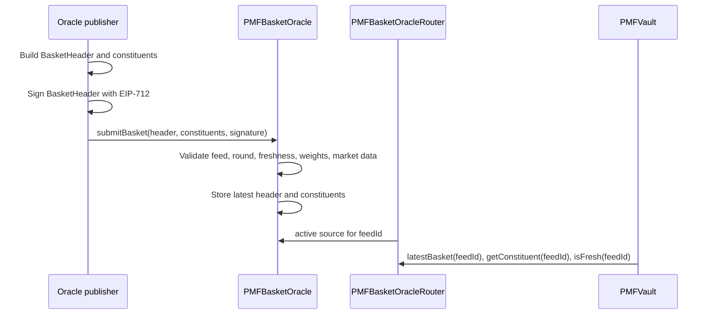
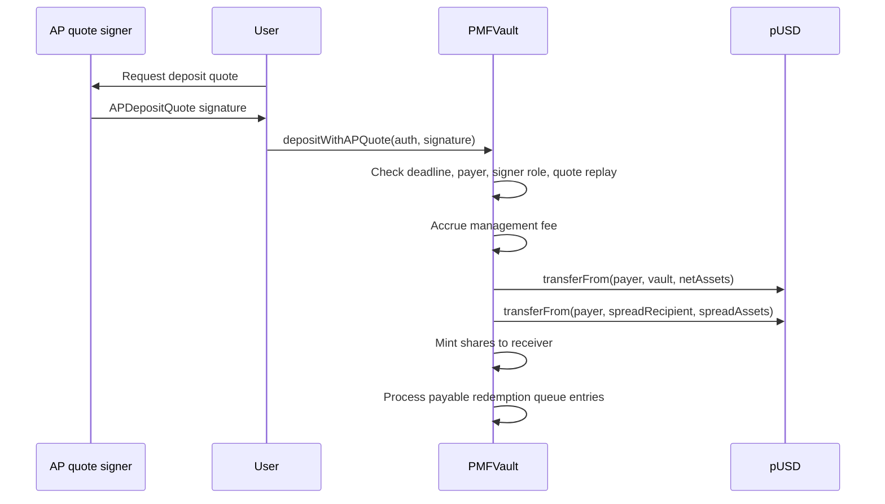
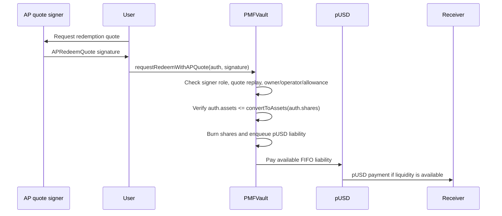
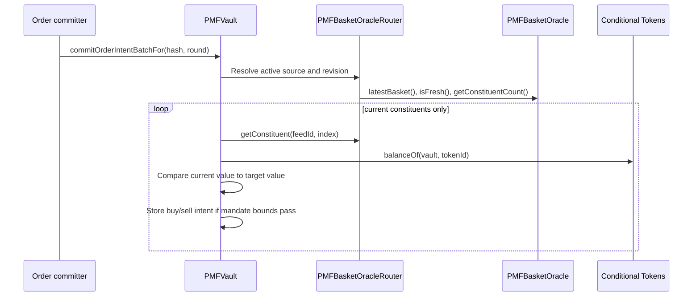
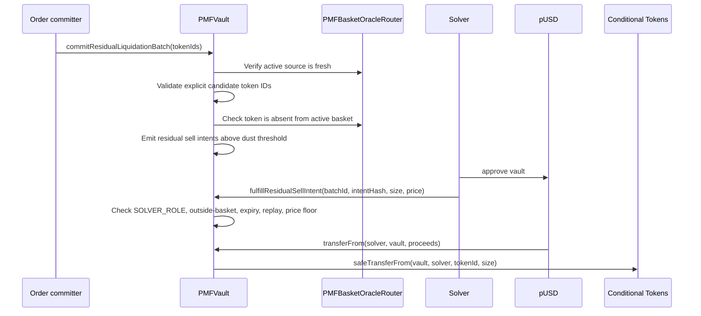
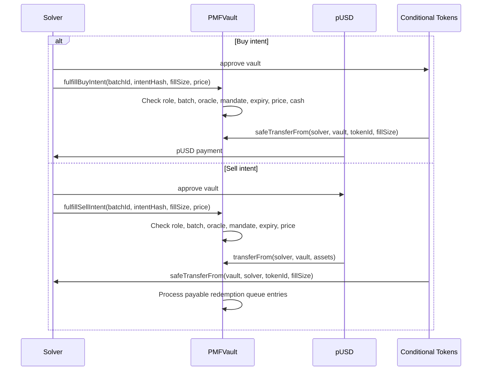
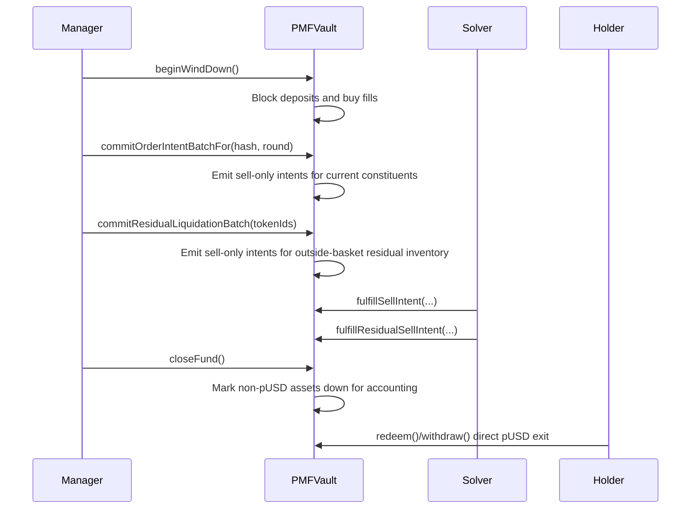

# Contract Data Flow

This document describes the current vault, oracle, redemption, and intent flows.

## Oracle Publication

The snapshot oracle stores the latest target basket. The router selects the
active compatible basket source for a feed ID. Neither the snapshot oracle nor
the router stores historical constituents or cleanup inventory.

## AP Deposit

Direct ERC-4626 `deposit` and `mint` are intentionally disabled.

## AP Redemption Request

The vault records the exact pUSD liability at request time. Later NAV changes do
not change an already queued request.

## Order Intent Commit

Target rebalance only sees current basket constituents. Outside-basket inventory
is handled by residual liquidation, not by re-adding stale tokens to the normal
basket.

## Residual Liquidation

The intent committer owns residual candidate discovery from events, inventory,
and reconciliation state; the vault skips candidates that are unknown, current
basket constituents, zero-balance, dust, or not state-ready. Residual sales
require `priceE18 >= 0.001e18`. Uneconomic balances below the configured
`minOrderNotional` threshold at that floor are marked ignored so closed or
expired worthless positions do not create recurring work.
Managers can reset ignored residual inventory for another attempt with
`resetIgnoredResidualToken(tokenId)`; the vault rejects resets for unknown,
tracked, or currently open residual inventory.

## Solver Fill

The vault transfers out value only after it receives the counter-asset.

## Wind-Down And Final Close

Wind-down target batches only cover current basket constituents. Residual
batches cover known outside-basket CTF inventory through the same permissioned
solver boundary.
