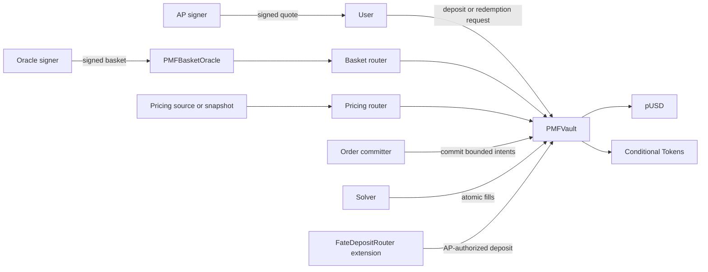

# PMF Contracts System Overview

The PMF contract system combines an immutable ERC-4626 vault with signed basket publication, delayed source routing, AP-authorized issuance and redemption, and solver-filled trading intents.

## Components

| Contract | Purpose | Deployment model |
| --- | --- | --- |
| `PMFVault` | Holds pUSD and CTF positions, issues shares, records redemption liabilities, accepts NAV reports, commits bounded intents, and manages wind-down. | Immutable deployment with linked libraries. |
| `PMFBasketOracle` | Stores the latest EIP-712 signed target basket and market observations for one feed. | Immutable deployment per feed. |
| `PMFBasketOracleRouter` | Selects an allowlisted basket source with delayed replacement. | Immutable router with role-controlled configuration. |
| `PMFPricingRouter` | Validates snapshot pricing references and optionally routes primary pricing sources. | Immutable router with role-controlled configuration. |
| `PMFOracleRegistry` | Provides a delayed service-facing address registry. | Immutable registry. |
| `FateDepositRouter` | Escrows asynchronous deposit orders for configured products. | Optional extension, separate from the vault core. |

## External trust and dependencies

- pUSD is the ERC-20 vault asset.
- Polymarket Conditional Tokens are ERC-1155 positions held and exchanged by the vault.
- AP signers choose deposit and redemption quote terms.
- NAV reporters attest external asset values.
- Oracle signers attest target baskets and market data.
- Order committers create bounded intent batches.
- Solvers decide whether and when to fill stored intents.
- Governance manages privileged roles and lifecycle controls.

The contracts verify authorization, freshness references, replay identifiers, mandate constraints, fill accounting, and counter-asset receipt. They do not independently calculate NAV, discover market prices, distribute quotes, or guarantee execution.

## High-level flow

## Lifecycle

1. An AP-signed quote authorizes a deposit or asynchronous redemption request.
2. NAV reporters bind external-asset reports to a fresh basket source and round.
3. Order committers materialize target or residual intents within the current mandate.
4. Solvers deliver the counter-asset before receiving vault assets.
5. Redemption liabilities are paid FIFO as pUSD becomes available.
6. Wind-down blocks deposits and buy fills while allowing liquidation and redemption processing.
7. Final close stops AP and trading flows and opens direct ERC-4626 exits against unreserved pUSD.
